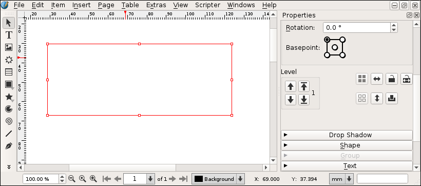

# La Newsletter della comunità di Scribus, Ottobre 2015

Eccovi il primo numero della newsletter prodotta dalla comunità di Scribus.

I temi principali di questo mese sono il nuovo set di icone in Scribus 1.5svn e le nuove funzionalità per la manipolazione di documenti e la produzione di PDF dalla linea di comando.

## Il nuovo set di icone

Recentemente è stato aggiunto un nuovo set di icone alla versione di sviluppo di Scribus.

Questo nuovo set di icone è stato create da Dezso Markon, un nuovo contributore, e, nonostante non sia ancora completo al 100%, copre già più dell'80% delle icone esistenti.
Anche se potrebbe richiedere qualche momento per abituarsi alla semplice scelta cromatica, è sicuramente piacevole vedere un set di icone che mantiene un design coerente in tutta la sua progettazione.

Durante il processo di integrazione del nuovo set di icone, Craig Bradney, uno degli sviluppatori storici di Scribus, si è occupato di migliorare la capacità di gestione delle icone di Scribus. Quindi, in futuro, i graphic designer avranno la possibilità di proporre con maggiore semplicità nuovi set di icone e gli utenti potranno scegliere con un click!

Voglia di provare le nuove icone?

1. Scarica una versione di Scribus compilata con il codice successivo a luglio 2015:
  - Su Linux è possibile compilare Scribus o scaricarlo dal PPA per Ubuntu
  - Su Mac è possibile [installarlo con Homebrew](https://github.com/scribusproject/homebrew-scribus/) o [scaricare Scribus 1.5.1](http://www.scribus.net/downloads/unstable-branch/) appena sarà disponibile.
  - Su Windows sarà necessario attendere il rilascio di [Scribus 1.5.1](http://www.scribus.net/downloads/unstable-branch/).
2. Apri "File > Preferenze"
3. Sotto "Generali > Apparenza" scegli il tema "Scribus 1.5.1"
4. Riavvia Scribus

_Attenzione_: in precedenti versioni di questa newsletter, abbiamo erroneamente affermato che il nuovo set di icone fose presente in Scribus 1.5.0.

### Dezso Markon: il designer che ha creato il nuovo set di icone

Dezso Markon, il designer del nuovo set di icone per 1.5.1 ha gentilmente accettato di partecipare ad una breve intervista:

_Presentati alla comunità di Scribus..._

Mi chiamo Dezso Markon, sono un designer, vivo in Romania, Transilvania, e sono di nazionalità ungherese. Utilizzo Linux da vent'anni e, attualmente uso Arch con Xfce.

_Cosa ti ha motivato a contribuire ad un progetto Free Libre Open Source?_
Nel 2006, quando fondammo la nostra azienda (<http://www.vitaking.ro/>), il mio lavoro era quello di creare il primo catalogo contenente i prodotti di vitamine in vendita. Iniziai a lavorare su Linux, ma dopo un paio di giorni realizzai che le applicazioni di desktop publishing su Linux non fossero ancora pronte. Così, il nostro primo catalogo fu progettato su Windows. Rimasi infastidito da questo fallimento, così iniziai a cercare una risposta al problema di "come creare un valido metodo di lavoro su Linux?"

Il nostro secondo e terzo catalogo furono progettati con Scribus, ma la preparazione delle immagini e delle illustrazioni vettoriali necessitava ancora del pacchetto di Adobe.

## About this newsletter (TODO: da tradurre)

Questa newsletter è pubblicata da contributori della comunità di Scribus.  
Il nostro scopo è di produrre un numero al mese e presntare i molteplici aspetti della comunità di Scribus.

La rediazione per il numero di ottobre è composta da Ale e Kunda.

Puoi contribuire attraverso la repository Github <https://github.com/aoloe/scribus-newsletter> o contattandoci nel modo che preferisci ([forum](http://forums.scribus.net), [IRC](http://webchat.freenode.net/?channels=scribus), [mailing list](http://lists.scribus.net), [twitter](https://twitter.com/scribus), email, ...).

Attualmente, siamo alla ricerca di nuovi redattori, traduttori e di un designer che ci aiuti a migliorare il CSS di questa newsletter.  
A medio termine, vorremmo che dei designer creino una versione PDF delle newsletter.

Puoi anche proporre dei temi che ti stanno a cuore aggiungendo un commmento al [ticket per il prossimo numero](https://github.com/aoloe/scribus-newsletter/issues/7)).

Questa newsletter è pubblicata con licenza Creative Commons:  
CC-BY-SA, la Newsletter della communità di Scribus (<http://impagina.org/newsletter>)
